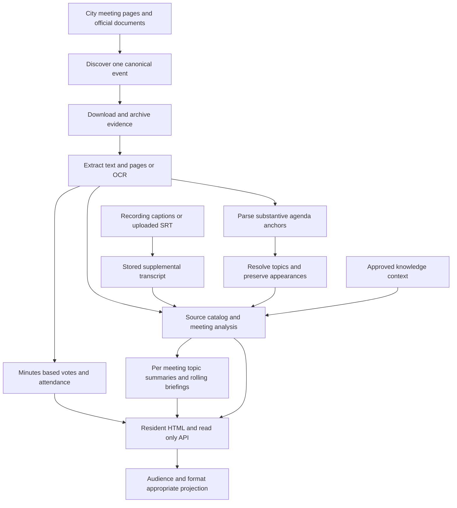

# Data dependencies and background behavior

These transitions change user-visible state without another form submission.
They need the same start/action/result/observation/follow-up reasoning as browser
workflows. This baseline inspected source/configuration; no jobs were executed,
sources fetched, or production schedules verified.

## Dependencies and record meaning

| Records | User-visible meaning and authority | Depends on / consumers |
| --- | --- | --- |
| `User`, `MembershipApplication` | Website membership and private submitted profile/review state | Email/application tokens; own Profile and admin User Accounts |
| `Session`, `MagicLink`, `PasskeyCredential`, `KnownContext`, `SignInAttempt` | Authentication, proof freshness, remembered context, bounded link delivery | Browser cookie/challenge, server eligibility, provider email; AUTH-01–12 |
| `ApiAccessToken`, `AuditEvent` | Fixed-scope API authority and sensitive-action snapshots | Eligible owner, HMAC secret, expiry/revocation; AUTH-13–15/ADM-20 |
| `SiteSetting`, `Current` | Open/gated mode and per-request identity/access memoization | Setting defaults to open if absent; not an account-approval setting |
| `Committee`, `CommitteeAlias` | Current governing-body identity and context; meeting retains historical body name | Discovery resolution; public directory, AI prompt context |
| `Member`, `MemberAlias`, `MemberPosition`, `CommitteeMembership` | Civic people, name resolution, current public offices/board rosters | Canonical/manual/seeded/attendance authority precedence; RES-09/10 |
| `Meeting`, `MeetingDocument` | Event identity, cancellation, associated committee, archived originals/recording and extraction quality | City page/HTML/PDF/captions; RES-05–08/API; scheduled does not mean proved held |
| `Extraction`, `AgendaItem`, `AgendaItemDocument` | Text/page evidence, substantive agenda anchors and documents | Download/PDF extraction/OCR/agenda parse; topic and motion matching |
| `Motion`, `Vote`, `MeetingAttendance` | Current meeting's official motion/vote and roll-call record | Minutes extraction and identity resolution; not inferred official outcomes from transcript |
| `Topic`, `TopicAlias`, `TopicBlocklist`, `AgendaItemTopic`, `TopicAppearance`, `TopicStatusEvent`, `TopicReviewEvent` | Persistent concern, canonical lookup, review/reuse/lifecycle state and event continuity | Substantive evidence, extraction/triage/continuity and human corrections |
| `MeetingSummary`, `TopicSummary`, `TopicBriefing` | Generated resident analysis, per-meeting topic context and rolling history | Source catalog, complete source text, retained agenda IDs, allowed knowledge context |
| `KnowledgeSource`, `KnowledgeChunk`, `KnowledgeSourceTopic` | Background retrieval context with origin/status/verification | Note/PDF ingestion, embeddings, extracted/pattern material; remains separate from official artifacts |
| `Entity`, `EntityFact`, `EntityMention`, `StanceObservation` | Internal knowledge/evidence structure | Internal extraction/retrieval; no standalone resident CRUD interface mapped |
| `PromptTemplate`, `PromptVersion`, `PromptRun` | Saved prompt contract/version and retained model input/output | All AI via `Ai::OpenAiService`; admin prompt editor/examples; excluded from resident API |
| `GeneratedImage`, Active Storage attachments | Illustrative asset with source/override/status/fingerprint | Uploaded/generated file; public display only when selected/ready; not evidence |
| `TranscriptImport`, Solid Queue executions/processes | Workflow progress/errors versus job scheduling/completion/worker heartbeat | Admin workflow and workers; these are separate stores of success/failure evidence |
| `Redirect` | Maintained historical topic/URL navigation, hit counter and cache | Topic merge or admin change; middleware GET/HEAD before route dispatch |

Sources: [models](../../app/models/application_record.rb),
[architecture handbook](../../CLAUDE.md), [development plan](../DEVELOPMENT_PLAN.md),
and workflow-specific links below. There is no public commenting, self-approval,
profile editing, event registration, or notification-center workflow in this
route/interface inventory. Do not infer those capabilities from generic models.

## Reporting flow

This is a conceptual dependency map, not a promise of synchronous execution.
Jobs can be queued/delayed, skipped, retried, or fail between these boundaries.

## BG-01 — Discover/update an event and preserve cancellation (P1)

- **Start / data:** city listings, exact committee/start identity, alternate
  detail URLs/titles and cancellation; existing records/documents.
- **Trigger:** scheduled discovery or explicitly launched full pipeline refresh.
- **Required state / visible outcome:** identify new/changed events and enqueue
  needed processing; maintain one public canonical event without losing source
  records. A stale listing does not undo cancellation (RES-08).
- **Next:** newly linked documents advance enrichment; unchanged discovery does
  not misrepresent a new source publication or content update.
- **Failure variants:** unreachable/changed HTML, unresolved body, duplicate race,
  malformed time, parse failure after discovery, missing worker.
- **Observed:** [DiscoverMeetingsJob](../../app/jobs/scrapers/discover_meetings_job.rb),
  [ParseMeetingPageJob](../../app/jobs/scrapers/parse_meeting_page_job.rb),
  [FullPipelineRefreshJob](../../app/jobs/scrapers/full_pipeline_refresh_job.rb),
  [Meeting](../../app/models/meeting.rb).
- **Reviewed scheduling contract:** recurring.yml currently declares discovery
  daily at 11pm. The older unscheduled/six-hour suggestion is historical.
  Configuration and a passing local enqueue test do not prove production
  execution or the city's publication time; see [behavior contracts](behavior-contracts.md).

## BG-02 — Enrich agenda/packet content, then supersede with minutes (P0)

- **Start / data:** archived agenda/packet with multiple substantive items;
  later minutes containing distinct closing action and official votes/attendance;
  separately scanned/empty PDF and same SHA/HTTP 304 refetch.
- **Trigger:** document arrival/download→text/page extraction/OCR→agenda/topic work→recap.
- **Required state / visible outcome:** original artifact/quality retained;
  agenda evidence/associations survive minutes re-extraction; preferred recap is
  minutes > transcript > packet > agenda preview. Source/timing banners remain
  honest, and the site can expose schedule/sources when AI fails.
- **Next:** verify source characters/pages and distinctive events → parsed agenda
  IDs → topic appearances → recap item details/highlights → topic context/briefing →
  HTML/API. Compare counts AND distinct identities/content at each major boundary.
- **Failure variants:** download failure, OCR poor/no text, missing prompt,
  unsupported motion excerpt/tally, context overflow, stale lower-tier recap,
  partial enqueue races. Delay is not completion evidence.
- **Observed:** [DownloadJob](../../app/jobs/documents/download_job.rb),
  [AnalyzePdfJob](../../app/jobs/documents/analyze_pdf_job.rb),
  [OcrJob](../../app/jobs/documents/ocr_job.rb),
  [ParseAgendaJob](../../app/jobs/scrapers/parse_agenda_job.rb),
  [ExtractVotesJob](../../app/jobs/extract_votes_job.rb),
  [SummarizeMeetingJob](../../app/jobs/summarize_meeting_job.rb).
  Source branches queue packet recap immediately, agenda preview after 5 minutes,
  and minutes recap after 10 minutes. None was run for the map.

## BG-03 — Add recording context without replacing official evidence (P0)

- **Start / data:** council recording/captions or uploaded SRT, substantive packet/
  agenda and optional current minutes; long transcript with distinct final action.
- **Trigger:** discovered transcript, direct transcript task, or ADM-14 workflow.
- **Required state / visible outcome:** store raw SRT and plain text with recording
  provenance; captions support preliminary attributed reporting. Available official
  proposal evidence remains supplied; minutes retain authority when present.
  Full input is retained or analysis fails instead of silently truncating.
- **Next:** compare input and final action through meeting analysis→topic summary→
  rolling briefing→display. Published recording remarks are paraphrases. Transcript
  observations do not create official `Motion`/`Vote` records.
- **Failure variants:** blocked/no captions, wrong date/video/meeting, invalid SRT,
  reused/replaced transcript, provider failure, lost packet PDF or closing text.
- **Observed:** [DiscoverTranscriptsJob](../../app/jobs/scrapers/discover_transcripts_job.rb),
  [TranscriptDownloader](../../app/services/documents/transcript_downloader.rb),
  [UploadedTranscriptImporter](../../app/services/documents/uploaded_transcript_importer.rb),
  [workflow job](../../app/jobs/admin/transcript_import_workflow_job.rb),
  [meeting summarizer](../../app/jobs/summarize_meeting_job.rb).

## BG-04 — Update topic continuity and resident priorities (P1)

- **Start / data:** exact/alias/novel concern, multiple agenda appearances and
  bodies, historical/future evidence, protected human overrides and blocklists.
- **Trigger:** topic extraction/reanalysis, triage, continuity, briefing/description
  refresh; ADM-06/07/08 correction followed by downstream work.
- **Required state / visible outcome:** specific persistent concern retains civic
  memory; uncertainty/scope/major identity changes remain reviewable. No routine
  procedural category substitutes for a topic. Missing analysis is not evidence
  to erase substantive appearances. Law-rewrite versus individual-appeal priority
  follows the explicit Governance contract, not a low-salience model label.
- **Next:** public identity/impact/headline/timeline and API updated discovery
  reflect supported changes; manual description/impact overrides are preserved;
  disappearance alone is not resolution.
- **Failure variants:** collapsed distinct events, wrong agenda ID/body/date,
  alias normalizer collision, blocked canonical name reuse, future knowledge
  leaking into past per-meeting context, lost preliminary provenance.
- **Observed:** [ExtractTopicsJob](../../app/jobs/extract_topics_job.rb),
  [MeetingReanalysisService](../../app/services/topics/meeting_reanalysis_service.rb),
  [ItemDetailsMatcher](../../app/services/topics/item_details_matcher.rb),
  [SummaryContextBuilder](../../app/services/topics/summary_context_builder.rb),
  [briefing job](../../app/jobs/topics/generate_topic_briefing_job.rb),
  [description job](../../app/jobs/topics/generate_description_job.rb),
  [Topic Governance](../topics/TOPIC_GOVERNANCE.md).

## BG-05 — Reconcile current rosters without rewriting attendance (P1)

- **Start / data:** canonical council/manager/organization roster, manual override,
  seeded memberships, recent minutes roll call and uncovered body.
- **Trigger:** explicit `rosters:sync` / reviewed `rosters:repair`; attendance extraction/reconciliation.
- **Required state / visible outcome:** manual > official city > organization >
  seeded > AI-derived fallback. Partial/malformed canonical source fails before
  ending valid memberships. Meeting attendance describes that meeting, not current office.
- **Next:** RES-09/10 and API show correct current title/role/provenance while
  historical attendance survives; uncovered board may have incomplete roster.
- **Failure variants:** source count/sections changed, duplicate names, guests
  misclassified, competing manual/source authority, stale office, withdrawn roster.
- **Observed:** [source registry](../../app/services/canonical_rosters/registry.rb),
  [Synchronizer](../../app/services/canonical_rosters/synchronizer.rb),
  [MembershipReconciler](../../app/services/committees/membership_reconciler.rb),
  [extraction job](../../app/jobs/extract_committee_members_job.rb),
  [roster tasks](../../lib/tasks/rosters.rake). No recurring roster sync is listed in this baseline config.

## BG-06 — Deliver notifications and retire expired auth evidence (P1)

- **Start / data:** newly submitted applications, last notification time,
  failed delivery, expired/used links and old contexts/sessions/throttle records.
- **Trigger:** submission notification job, synchronous sign-in/decision mail,
  daily expired-auth cleanup.
- **Required state / visible outcome:** owner receives intended usable email;
  admin batches are bounded and submitted applications are eventually surfaced;
  cleanup retires expired data without revoking valid authority/erasing audit.
- **Next:** AUTH-02/08 proves delivered-link use, not merely service return;
  known-context retention/cap reflect policy. Cooldown notification rescheduling
  is unresolved (V-08).
- **Failure variants:** missing production template/config, provider timeout,
  cooldown drops pending notification, invalid absolute link, cleanup deletes active record.
- **Observed:** [TransactionalEmail](../../app/services/transactional_email.rb),
  [LoopsDelivery](../../app/services/loops_delivery.rb),
  [notification job](../../app/jobs/admin_application_notification_job.rb),
  [cleanup](../../app/jobs/expired_auth_records_cleanup_job.rb),
  [KnownContext](../../app/models/known_context.rb).

## BG-07 — Refresh crawler verification and expire diagnostics (P1)

- **Start / data:** cached official IP-range feeds, valid/invalid/expired ranges,
  configured trusted proxy chain and explicitly created 48-hour synthetic probes.
- **Trigger:** recurring feed refresh; later crawl/probe request and expiry.
- **Required state / visible outcome:** current exact identity+range can read only
  authorized reporting/discovery representations; invalid/missing/expired data
  falls back to anonymous gating. Page request does not fetch verification feeds.
- **Next:** feed failure is not an open access grant; expired diagnostic URL gives
  404 and synthetic content cannot enter sitemap/reporting. Crawler visits do not
  prove search indexing or publisher-tool submission.
- **Failure variants:** changed feed format, stale ranges, identity spoof, forwarded
  IP spoof, non-HTML format, expired probe still revealing content.
- **Observed:** [RefreshIpRangesJob](../../app/jobs/crawlers/refresh_ip_ranges_job.rb),
  [IpRanges](../../app/services/crawlers/ip_ranges.rb),
  [Verifier](../../app/services/crawlers/verifier.rb),
  [Probe](../../app/services/crawlers/probe.rb), [crawler policy](../verified-crawler-access.md).

## Configured recurring entry points

These are strings in [config/recurring.yml](../../config/recurring.yml), not proof
of production worker execution. Application time zone is Central; runtime
scheduler zone/timing and worker liveness still need verification.

| Entry | Configured schedule | User-visible consequence |
| --- | --- | --- |
| Crawler IP refresh | Every hour at minute 7 | Verified full-reporting access or fail-closed teaser |
| Clear finished Solid Queue jobs | Every hour at minute 12 | Queue history retention; not source/content deletion |
| Topic description refresh | Monday at 3am | Eligible stale generated description; manual text remains protected |
| Meeting discovery | Every day at 11pm | New meetings/document links and downstream processing |
| Knowledge pattern extraction | Monday at 3:30am | New proposed/reviewable background context |
| Homepage topic image refresh | Every 6 hours | Eligible illustrative assets for current topic selection |
| Expired auth cleanup | Every day at 4am | Expired records/context/throttle retention cleanup |

No nightly QA review, workflow-map updater, automatic roster sync, or database
backup schedule appears in this file. This does not establish whether an
external production scheduler exists. Older plan statements that discovery is
unscheduled are superseded as an implementation observation (V-04).

## External boundaries and failure visibility

| Dependency | Affected workflow | Failure evidence / behavior to validate |
| --- | --- | --- |
| City meeting pages/PDFs and organization roster sites | BG-01/02/05, RES-07/09 | Preserve existing evidence; distinguish fetch/check time from publication time; malformed roster cannot erase valid membership |
| PDF tools, OCR, image backend, filesystem/Active Storage | BG-02, ADM-11/13/14 | Original attachment, extracted quality/count/pages, file availability, failed job stage; local missing generated blobs are expected |
| YouTube / `yt-dlp` | ADM-14, BG-03 | URL/metadata/caption status and stage log; SRT recovery keeps recording provenance; historical datacenter-blocking note is not a current availability check |
| Loops transactional delivery | AUTH-01/06/08/12, BG-06 | Provider failures differ from invalid input; intended recipient/template/absolute URL; production template IDs are checked at boot |
| AI/model and embedding providers | ADM-11/12/13/15/16/18, BG-02/03/04 | Retained PromptRun/input, error versus useful result, complete evidence preservation, no paid inspection by default; model/provider values depend on runtime configuration |
| Published crawler range feeds and reverse-proxy configuration | RES-11/12, BG-07 | Refresh validity/expiry, exact identity/IP, trusted forwarding, cache isolation |
| PostgreSQL, cache, Solid Queue workers | All persisted transitions/background work | Transaction outcome, genuine row state, idempotency, queue versus workflow status, stale heartbeat; source inspection cannot verify operational liveness |
| Browser WebAuthn/Turbo/clipboard/share/popups | AUTH-03/04/10/12/13, RES-06, ADM-01/06/07/14 | Real origin, method/CSRF, credential result, copied bytes, cancellation, focus/navigation; unit substitutes do not demonstrate these boundaries |

[ApplicationJob](../../app/jobs/application_job.rb) retries deadlock and specified
network failures and discards deserialization errors. Individual jobs can rescue
and log failures instead; ADM-14's workflow persists a failed status while
catching its exception. Queue completion and `TranscriptImport.completed` must
therefore be interpreted alongside downstream data. Recovery/reruns and
production commands require the repository's existing operational procedures;
this map adds no production authority or new schedules.
